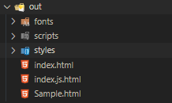

# 使用 jsDoc註解 來產生文件

# 安裝

  進行全域性安裝JsDoc

  ```
  npm install -g jsdoc
  ```
# 給程式加上 jsDoc 註解

```javascript
/** 
 * @class Sample
 */

(function (w, $) { 

  Test(1, 2, 3)
  
  /**
   * Sum of a and b , or a + b compare to c
   * @MemberOf Sample
   * @method Test
   * @param {Number} a AddValue1 
   * @param {Number} b AddValue2
   * @param {Number} [c] CompareValue
   * @returns {number | boolean} Sum of a and b , or a + b compare to c 
   * @example 
   * Add: Test(1,2)
   * Compare Test(1,2,3)
   */
  function Test(a, b, c) {
    if (c) {
      return a + b > c;
    }
    return a + b;
  }

})
```


[其他Tag](https://jsdoc.app/index.html#block-tags)


# 產出文件

```
jsdoc {filePath}
```

- `filePath` 可以是指定的檔案，或者是檔案路徑

會直接輸出一個 out的資料夾




輸出畫面為 


可以建立 README.md 來修改 Home 頁面的內容


需要在 jsdoc 檔案路徑後面 加上第二個參數 

```
jsdoc {filePath} README.md
```

重新打開文件


--- 

# 參考
[javascript使用jsdoc註解並快速產生api文件](https://www.gss.com.tw/blog/javascript%E4%BD%BF%E7%94%A8jsdoc%E8%A8%BB%E8%A7%A3%E4%B8%A6%E5%BF%AB%E9%80%9F%E7%94%A2%E7%94%9Fapi%E6%96%87%E4%BB%B6)

[其他系項設定](http://shouce.jb51.net/jsdoc/index.html)